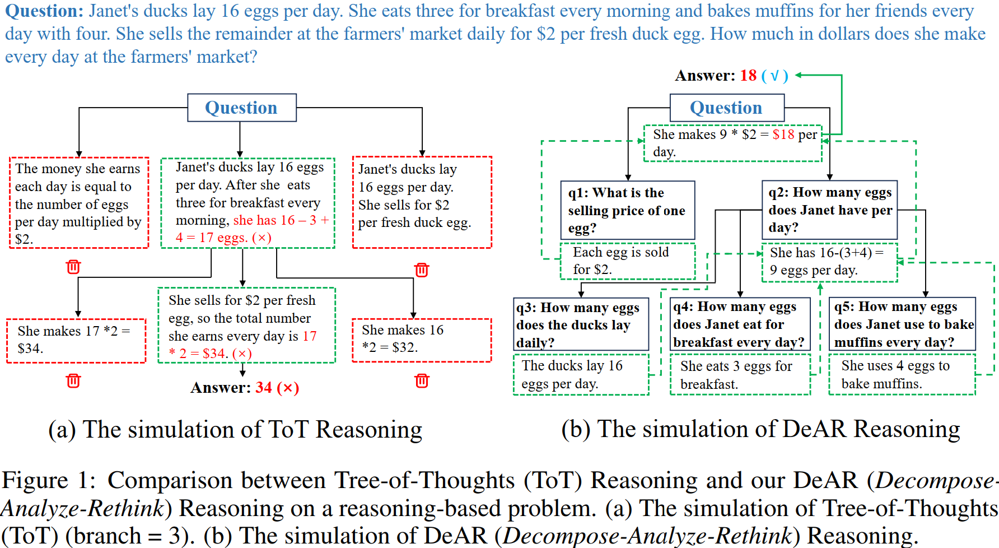
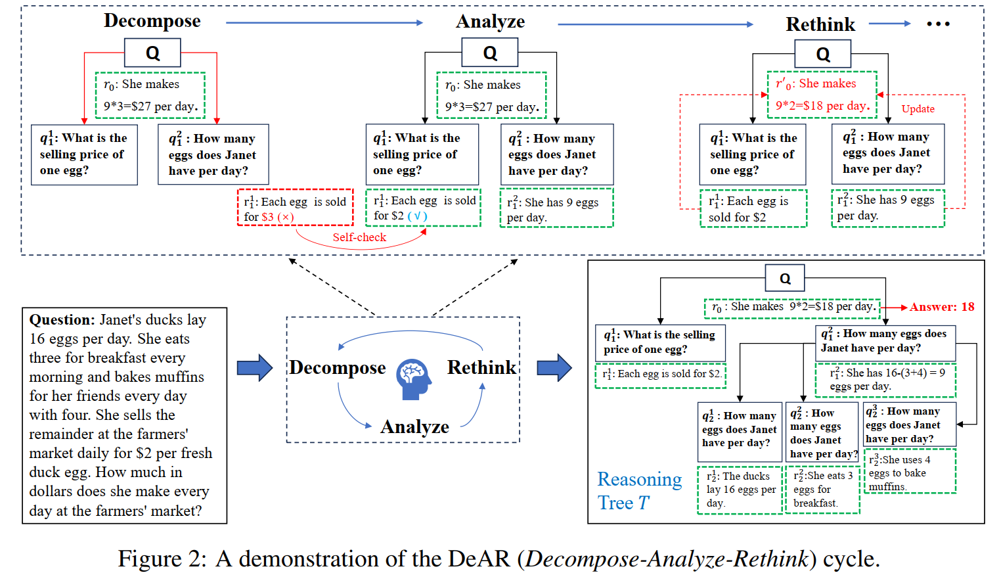

# \[NeurIPS2024\] Decompose, Analyze and Rethink: Solving Intricate Problems with Human-like Reasoning Cycle(DeAR) 

The DeAR (Decompose-Analyze-Rethink) framework is designed to improve reasoning accuracy in large language models (LLMs) by emulating human-like problem-solving strategies. This approach focuses on constructing a reasoning tree that decomposes complex problems into manageable sub-questions, analyzes each sub-question with rationales, and rethinks prior solutions based on new insights. The cycle of Decompose, Analyze, and Rethink fosters iterative refinement and error correction, ensuring a more accurate solution.

## Key Highlights ##
**1.Tree-of-Thoughts (ToT) vs. DeAR:** The DeAR framework outperforms the Tree-of-Thoughts (ToT) approach by introducing flexible reasoning trees that adapt in real time. In Figure 1, you can see a comparison of how both methods handle reasoning steps. While ToT rigidly maintains a fixed number of branches, DeAR dynamically updates its tree based on logical analysis, allowing for timely error correction and more accurate results.


**2.DeAR Cycle:** The DeAR cycle (illustrated in Figure 2) is at the core of our framework. It involves three stages:
*Decompose:* Breaking the complex question into simpler sub-questions.
*Analyze:* Solving the sub-questions with reasoning and feedback.
*Rethink:* Revising earlier solutions based on new information, ensuring logical consistency and precision in the final answer.
The framework’s performance has been tested on complex reasoning benchmarks like ScienceQA, StrategyQA, and GSM8K, demonstrating its superiority over other state-of-the-art methods, such as GoT and ToT, in both accuracy and efficiency.


If the reader wants to know the details of LBKT, please refer to the paper: *[Decompose, Analyze and Rethink: Solving Intricate Problems with Human-like Reasoning Cycle](https://openreview.net/pdf?id=NPKZF1WDjZ)*.
```bibtex
@inproceedings{NEURIPS2024_01025a4e,
 author = {Xue, Shangzi and Huang, Zhenya and Liu, Jiayu and Lin, Xin and Ning, Yuting and Jin, Binbin and Li, Xin and Liu, Qi},
 booktitle = {Advances in Neural Information Processing Systems},
 editor = {A. Globerson and L. Mackey and D. Belgrave and A. Fan and U. Paquet and J. Tomczak and C. Zhang},
 pages = {357--385},
 publisher = {Curran Associates, Inc.},
 title = {Decompose, Analyze and Rethink: Solving Intricate Problems with Human-like Reasoning Cycle},
 url = {https://proceedings.neurips.cc/paper_files/paper/2024/file/01025a4e79355bb37a10ba39605944b5-Paper-Conference.pdf},
 volume = {37},
 year = {2024}
}
```
